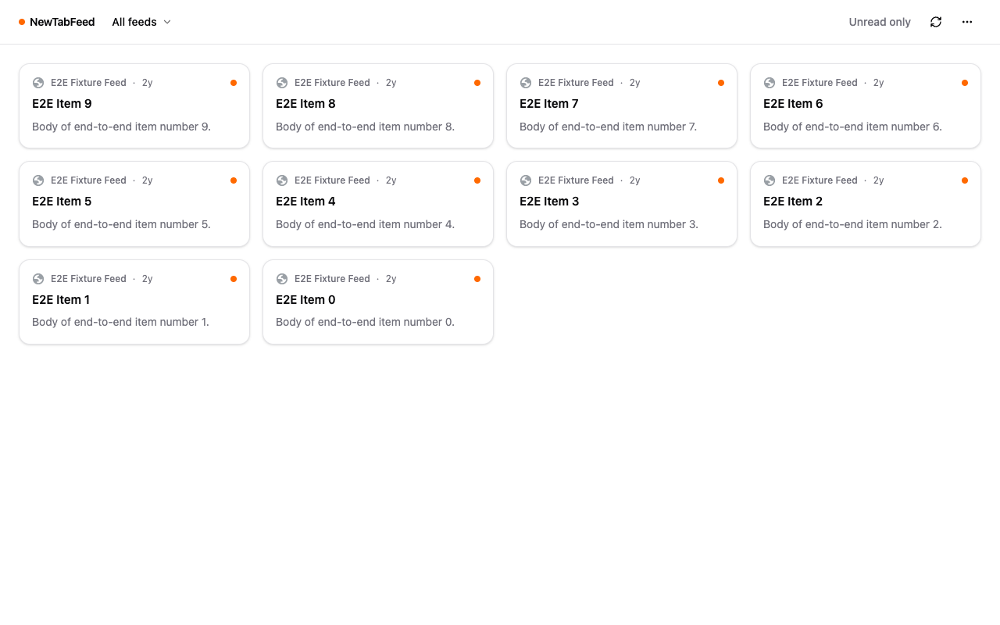
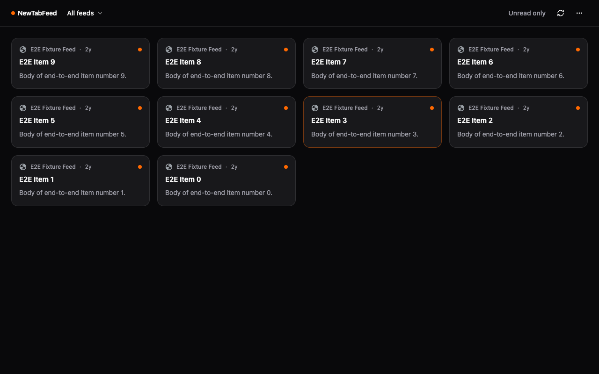

# NewTabFeed

**A local-first RSS reader in your new tab.** Your feeds, on your device — no accounts, no cloud, no ads.

NewTabFeed replaces Chrome's new tab page with a clean, newest-first reader for your RSS, Atom, RDF, and JSON feeds. Open a tab, read what's new, get on with your day.

## Why NewTabFeed

Most "discovery" new tabs decide what you should read and quietly measure how you read it. NewTabFeed does the opposite:

- **Your feeds, not a recommendation engine.** You choose every source. Items appear newest-first — no ranking, no algorithm, no promoted posts, nothing to game.
- **Local-first, genuinely.** Subscriptions and read state live in your browser's IndexedDB. There are no accounts and no sync servers, so there is nothing to leak and nothing to log in to. See [PRIVACY.md](./PRIVACY.md).
- **Own your data.** Import and export your whole subscription list as OPML whenever you want.
- **Calm by design.** It shows your feeds when you open a tab. That is the entire product; feature creep is the enemy.

## Features

- Fetch and parse RSS, Atom, RDF, and JSON Feed on-device.
- Card-grid new tab with favicons, source, and relative time; comfortable or compact density.
- First-run onboarding with a curated set of starter feeds (all opt-in).
- Add feeds by URL, or discover them from the site you're on — the toolbar icon lights up when the current page advertises a feed, and can probe common feed locations when it doesn't.
- OPML import and export.
- Per-feed filtering, unread-only view, and "mark all read".
- Background refresh on a schedule you set; light and dark themes.

## Install

**Chrome Web Store:** coming soon.

**Load unpacked (today):**

1. `pnpm install && pnpm build`
2. Open `chrome://extensions` and enable **Developer mode**.
3. **Load unpacked** → select `dist/chrome-mv3`.
4. Open a new tab to start onboarding.

## Screenshots

The card-grid new tab in light and dark themes (captured from the end-to-end suite; content is fixture data):

## Development

Requires [pnpm](https://pnpm.io) and Node 22+.

| Command                | What it does                                                                   |
| ---------------------- | ------------------------------------------------------------------------------ |
| `pnpm dev`             | Run WXT with hot reload (Chrome)                                               |
| `pnpm build`           | Production build → `dist/chrome-mv3`                                           |
| `pnpm zip`             | Package a distributable zip                                                    |
| `pnpm icons`           | Regenerate PNG icons from `assets/icon.svg`                                    |
| `pnpm test`            | Unit tests (Vitest, node project)                                              |
| `pnpm test:components` | Component tests (Vitest browser project — needs `playwright install chromium`) |
| `pnpm test:e2e`        | End-to-end tests (Playwright; builds the extension first)                      |
| `pnpm lint`            | ESLint                                                                         |
| `pnpm format:check`    | Prettier check                                                                 |
| `pnpm typecheck`       | TypeScript, strict                                                             |

End-to-end tests load the built extension into Playwright's bundled Chromium (Chrome and Edge no longer support the extension-loading flags). The suite runs against a local fixture server, so it never touches real feed sites.

## Architecture

Built on [WXT](https://wxt.dev) (MV3) with React, Tailwind, and TypeScript. The new tab reads feeds and items straight from IndexedDB for an instant first paint; an ephemeral service worker does all network fetching and parsing (feedsmith), stores results, and broadcasts updates. Feed refresh is driven by `chrome.alarms`. `<all_urls>` host access is an **optional** permission requested once, the first time you add a feed — never at install.

## Privacy

Everything stays on your device. NewTabFeed has no analytics, no accounts, and no third-party requests beyond fetching the feeds you subscribe to, directly from their own servers. Details in [PRIVACY.md](./PRIVACY.md).

## Contributing

Issues and pull requests are welcome. Before opening a PR, please run `pnpm lint`, `pnpm format:check`, `pnpm typecheck`, `pnpm test`, and `pnpm test:e2e`. Releases are cut by pushing a `v*` tag — see [docs/RELEASING.md](./docs/RELEASING.md).

## License

[MIT](./LICENSE) © Navendu Pottekkat
