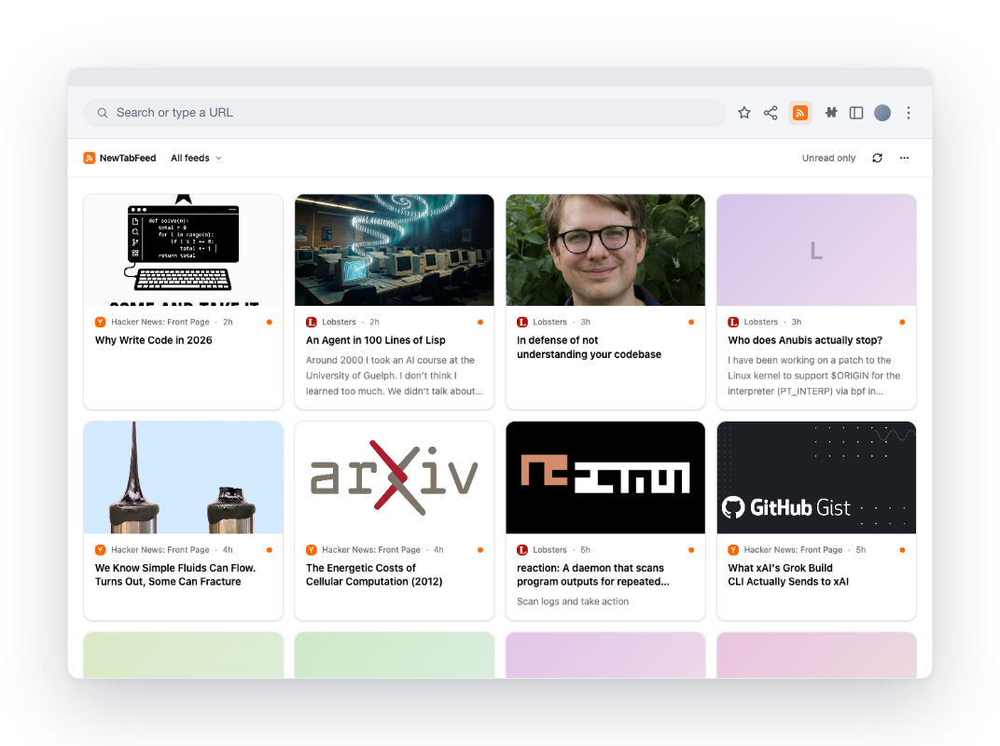
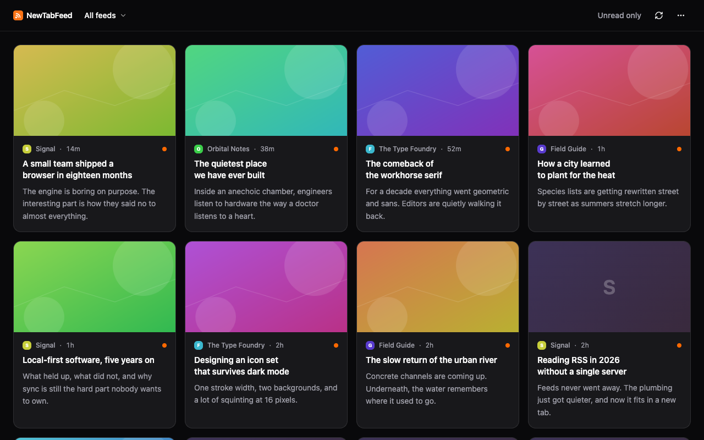

# NewTabFeed

A local-first RSS reader that replaces Chrome's new tab page. Your feeds stay on your device: no accounts, no cloud, no ads.

NewTabFeed shows your RSS, Atom, RDF, and JSON feeds newest-first every time you open a tab. You pick every source. Items appear in the order they were published, with no ranking, no algorithm, and no promoted posts. Open a tab, read what's new, get on with your day.

Everything stays in your browser. Subscriptions and read state live in IndexedDB, and you can import or export the whole subscription list as OPML whenever you want.

## Features

- Fetch and parse RSS, Atom, RDF, and JSON Feed on your device.
- A card-grid new tab with favicons, source, and relative time, in a comfortable or compact density.
- First-run onboarding with a curated set of starter feeds, all opt-in.
- Add feeds by URL, or discover them from the site you're on. The toolbar icon lights up when the current page advertises a feed, and can probe common feed locations when it doesn't.
- Optional link previews: when an item ships no image or only a thin summary, as link aggregators like Hacker News and Lobsters tend to, NewTabFeed fetches the linked article once for a cover image and description. On by default; turn it off in Settings.
- OPML import and export.
- Per-feed filtering, unread-only view, and mark-all-read.
- Background refresh on a schedule you set, with light and dark themes.

## Install

Chrome Web Store: coming soon.

To load it unpacked today:

1. `pnpm install && pnpm build`
2. Open `chrome://extensions` and enable **Developer mode**.
3. Click **Load unpacked** and select `dist/chrome-mv3`.
4. Open a new tab to start onboarding.

## Screenshots

The same card grid in dark theme:

## Development

You need [pnpm](https://pnpm.io) and Node 22 or newer.

| Command                | What it does                                                                  |
| ---------------------- | ----------------------------------------------------------------------------- |
| `pnpm dev`             | Run WXT with hot reload (Chrome)                                              |
| `pnpm build`           | Production build to `dist/chrome-mv3`                                         |
| `pnpm zip`             | Package a distributable zip                                                   |
| `pnpm icons`           | Regenerate PNG icons from `assets/icon.svg`                                   |
| `pnpm test`            | Unit tests (Vitest, node project)                                             |
| `pnpm test:components` | Component tests (Vitest browser project, needs `playwright install chromium`) |
| `pnpm test:e2e`        | End-to-end tests (Playwright, builds the extension first)                     |
| `pnpm lint`            | ESLint                                                                        |
| `pnpm format:check`    | Prettier check                                                                |
| `pnpm typecheck`       | TypeScript, strict                                                            |

End-to-end tests load the built extension into Playwright's bundled Chromium, since Chrome and Edge no longer support the extension-loading flags. The suite runs against a local fixture server, so it never touches real feed sites.

## Architecture

NewTabFeed is built on [WXT](https://wxt.dev) (MV3) with React, Tailwind, and TypeScript. The new tab reads feeds and items straight from IndexedDB for an instant first paint. An ephemeral service worker does all the network fetching and parsing (with feedsmith), stores the results, and broadcasts updates. Feed refresh runs on `chrome.alarms`. Host access to sites (`<all_urls>`) is an optional permission, requested once the first time you add a feed, never at install.

## Privacy

Your subscriptions and reading history stay on your device. There are no analytics and no accounts. The only network requests NewTabFeed makes go to the sites you chose: fetching your feeds from their own servers, and, when link previews are on, fetching a subscribed item's article page once to read its cover image and description. Those requests send no cookies, and nothing goes to any third party. Details in [PRIVACY.md](./PRIVACY.md).

## Contributing

Issues and pull requests are welcome. Before opening a PR, run `pnpm lint`, `pnpm format:check`, `pnpm typecheck`, `pnpm test`, and `pnpm test:e2e`. Releases are cut by pushing a `v*` tag. See [docs/RELEASING.md](./docs/RELEASING.md).

## License

Released under the [MIT License](./LICENSE).
